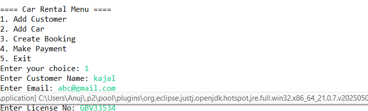
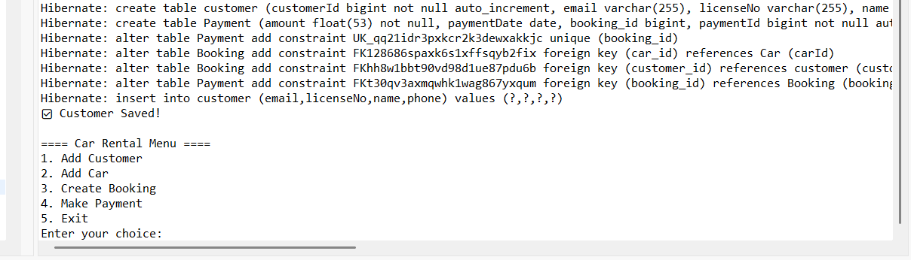

# 🚗 CarRental Hibernate Project    

## 📌 Overview  
This is a **Car Rental Management System** built using **Java + Hibernate (ORM)**.  
It provides basic functionality for managing:  
- Customers  
- Cars  
- Bookings  
- Payments  

The project demonstrates **Hibernate ORM with MySQL** and follows **DAO pattern** for clean separation of database logic.  

---

## 🛠️ Technologies Used  
- Java (JDK 8 or above)  
- Hibernate ORM (v5.x or v6.x)  
- MySQL Database  
- Maven (optional, if using)  
- Git & GitHub  

---

## 📂 Project Structure  

CarRental/
├── src/main/java/com/CarRental/
│ ├── entity/ # Hibernate Entities (Customer, Car, Booking, Payment)
│ ├── dao/ # DAO classes for CRUD operations
│ ├── util/ # HibernateUtil.java (SessionFactory config)
│ └── MainApp.java # Menu-driven main class
├── src/main/resources/
│ └── hibernate.cfg.xml # Hibernate configuration (DB connection, mappings)
├── pom.xml (if using Maven)
└── README.md

## 📸 Screenshots  

  

  
